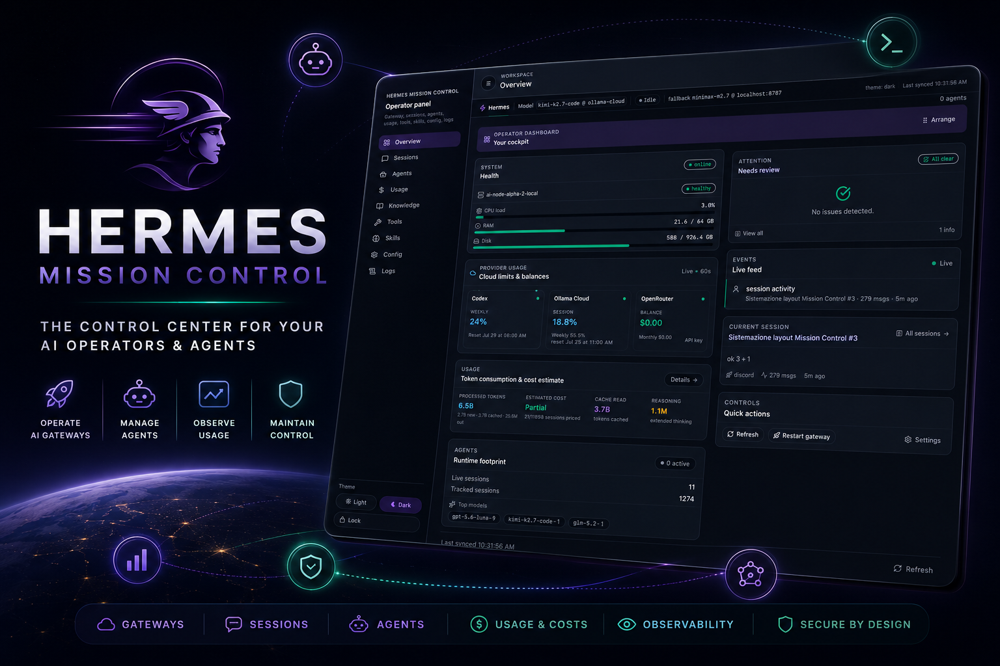

# Hermes Mission Control



Standalone operational dashboard for [Hermes](https://hermes-agent.nousresearch.com). It runs next to your Hermes agent, reads local telemetry, and gives you a cockpit for sessions, agents, usage, tools, skills, config, and logs.

## About

Mission Control is a local-first operator dashboard for Hermes. It combines a React/Vite frontend with a small Python telemetry sidecar, so the dashboard can run independently without coupling the open-source UI to Hermes core internals.

**Tags:** `hermes` · `mission-control` · `tldraw` · `whiteboard` · `agentic-ui` · `operations-dashboard` · `telemetry` · `react` · `typescript` · `vite` · `tailwindcss` · `python` · `local-first` · `self-hosted`

> **Satellite by design.** Mission Control has zero runtime dependency on the Hermes core backend. It talks to a small local telemetry sidecar (Python stdlib + psutil) on port `8765`.

## What you get

- Gateway/runtime health and system metrics
- Active model, fallback model, and agent status
- Sessions, agents, usage, knowledge, tools, skills, config, logs routes
- Cron/job visibility and quick actions
- Responsive layout: side rail on desktop, drawer on mobile
- Draggable dashboard widgets with persisted layout
- **Expanded Chat + tldraw Agent Mode**: session-bound whiteboard, authenticated bridge, screenshot-to-chat, agent actions, Mermaid import, board lints, exports, and mobile-safe persistence

## tldraw Agent Mode

Mission Control links the expanded Chat to a tldraw whiteboard using the current stable `sessionKey`. Hermes can read structured board context, receive a PNG screenshot in Chat, and apply validated actions back to the editable canvas through the authenticated local telemetry bridge.

- Session-bound persistence for shapes, pages, camera, and selection
- Agent modes: `draw`, `review`, `arrange`, `explain`
- Bridge protocol v2 with feature negotiation and transactional actions
- Action history surfaced in Chat
- PNG/SVG/JSON export and Mermaid flowchart import
- Mobile-safe open feedback and explicit close/unmount to keep iOS input responsive

For the Chat internals (WebSocket transport, presence pill, persistence, streaming & reasoning), see [docs/chat.md](docs/chat.md). See the [tldraw feature matrix](docs/tldraw-feature-matrix.md) and the [Mission Control tldraw Agent Mode vault note](https://github.com/albidev/hermes-vault/blob/main/wiki/concepts/mission-control-tldraw-agent-mode.md).

## Architecture

| Component | Path | Port | Stack |
|-----------|------|------|-------|
| Telemetry server | `server/local_telemetry_server.py` | `8765` | Python stdlib + psutil |
| Frontend | `src/` | `5174` | React + Vite + TypeScript + Tailwind |

All data flows through `/api/local/*` endpoints. In development, Vite proxies those requests to the telemetry server.

See [docs/telemetry.md](docs/telemetry.md) for the full telemetry overview, including the **provider-usage** pipeline (CodexBar → cache → gauges) and its troubleshooting.

## Quick start

```bash
cd apps/mission-control
pnpm install
python3 -m pip install -r server/requirements.txt
pnpm dev:full
```

This starts:
- Vite UI on `http://localhost:5174`
- Telemetry server on `http://localhost:8765`

To run them separately:

```bash
pnpm dev:telemetry   # port 8765
pnpm dev             # port 5174
```

## Configuration

Create `apps/mission-control/.env` from `.env.example`:

```bash
VITE_MISSION_CONTROL_LOCAL_API_BASE_URL=/api/local
VITE_MISSION_CONTROL_TOKEN=your_token
# Optional: comma-separated local/Tailscale hostnames or IPs
MISSION_CONTROL_DEV_HOSTS=
```

The bearer token is shared between the telemetry server and the UI. The telemetry server reads it from `.env` via the launcher script.

## Tailscale / LAN access

Vite listens on all interfaces (`host: true`) and `allowedHosts` is read from `MISSION_CONTROL_DEV_HOSTS`. The telemetry server binds to `0.0.0.0`. Both accept Tailscale peer IPs.

## Building

```bash
pnpm build
```

Static output lands in `dist/` and can be served by any static host.

## Testing

```bash
pnpm build
pnpm test
```

For a live telemetry sidecar, start `pnpm dev:telemetry` in one terminal, export `MISSION_CONTROL_TOKEN`, then run:

```bash
pnpm test:smoke
```

CI runs the frontend build and Python test suite on pushes and pull requests.

## Security notes

- Never commit `.env`.
- The telemetry server requires a bearer token for every `/api/local/*` request.
- Mission Control is a local tool: bind only to trusted networks.

## Contributing

See [CONTRIBUTING.md](CONTRIBUTING.md).

## License

MIT — see [LICENSE](LICENSE).
